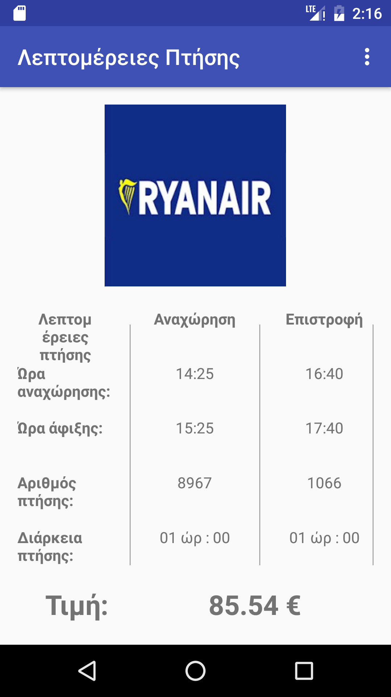

# Fly-me-to-the-moon-app

##Application Logo:
   

Fly me to the moon is an Android App which made for academic purposes.

With this app, you can search for flights all over the world. 

Below you can see some screenshots of the app.

##Screenshot 1: The Welcome Screen.
   

##Screenshot 2: The Search Activity Screen.
  

##Screenshot 3: The Results Activity Screen.
  

##Screenshot 4: The Details Activity Screen.
  

##Screenshot 5: The Settings Screen.
  

##Screenshot 6: The Share on Messenger example.
  

      
